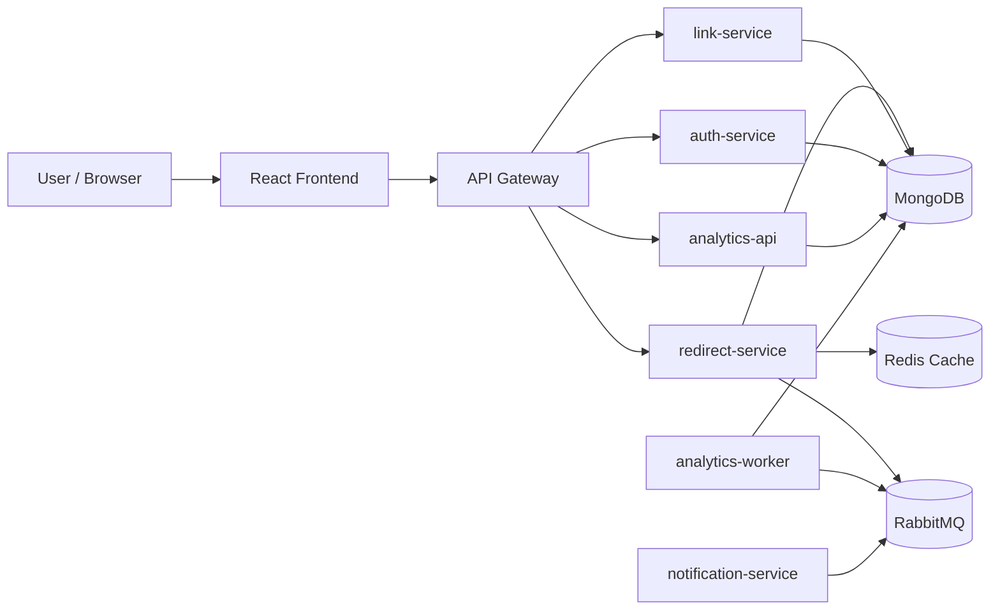
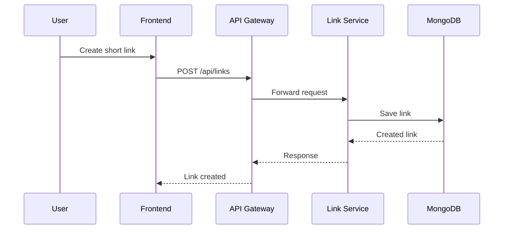
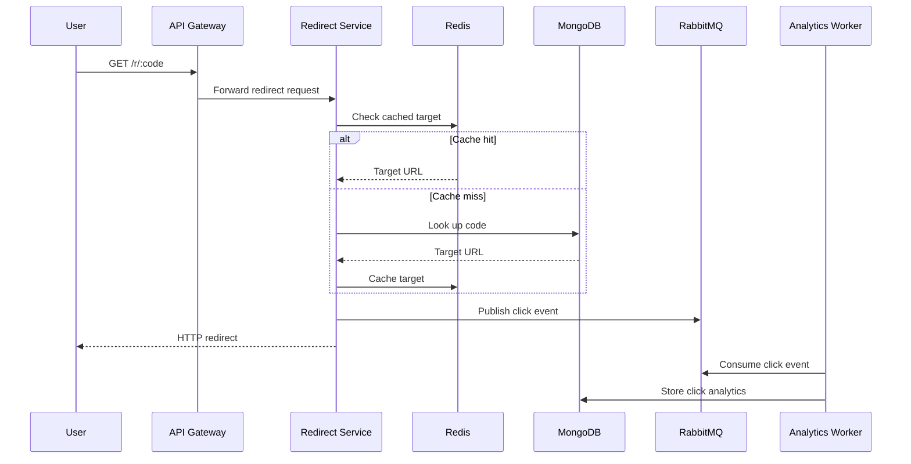

# PKLinks Flow

## Architecture Diagram

## Link Creation Flow

## Redirect and Analytics Flow

## Auth Flow

- User opens login or signup page
- Frontend sends auth request to gateway
- Gateway proxies request to `auth-service`
- Auth service validates user data in MongoDB
- JWT/auth state is returned to frontend

## Analytics Read Flow

- User opens analytics page for a link
- Frontend requests `/api/links/:code/analytics`
- Gateway forwards to `analytics-api`
- Analytics API reads aggregated analytics data from MongoDB
- Response returns to frontend dashboard

## Frontend Route Flow

- `/login`
- `/signup`
- `/forgot-password`
- `/reset-password`
- `/dashboard`
- `/dashboard/links`
- `/dashboard/links/:code`
- `/dashboard/links/:code/analytics`
- `/r/:code`

## Service Responsibility Summary

- Gateway: external routing, shared middleware, auth-aware forwarding
- Auth service: identity and credential workflows
- Link service: write-side link operations
- Redirect service: low-latency link resolution
- Analytics API: read-side analytics queries
- Analytics worker: background event processing
- Notification service: event-driven notifications

## Operational Notes

- Redis matters most for redirect speed
- RabbitMQ matters most for non-blocking analytics/event flow
- MongoDB remains the primary source of persistent truth
- Gateway is the main backend surface for browser clients
