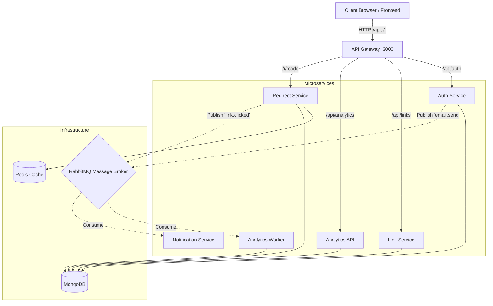
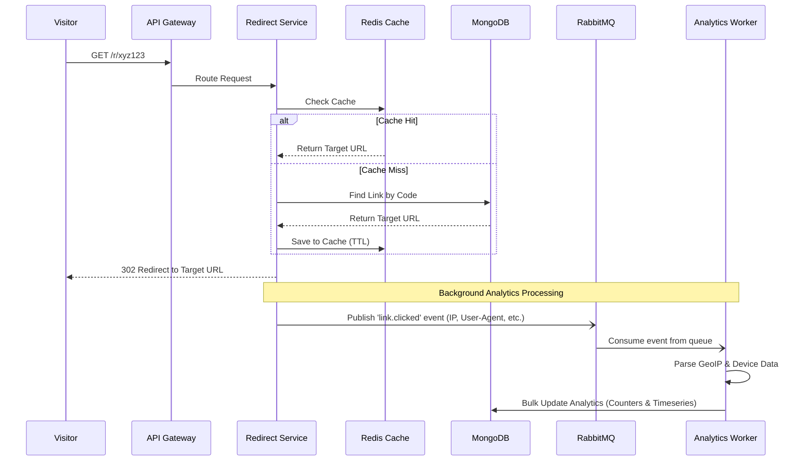
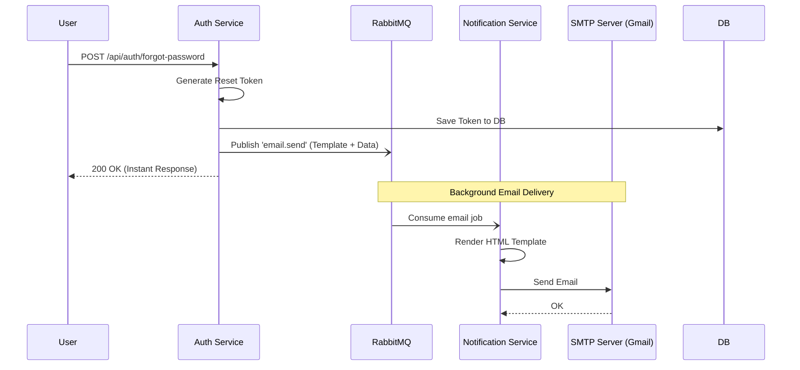

# 🔗 PKLinks Platform

PKLinks is a high-performance, microservices-based URL shortener and analytics platform. It features robust user authentication, high-speed cached redirections, and asynchronous background analytics processing.

## 🏛️ Architecture Overview

The system is built on a distributed microservices architecture to ensure scalability and separation of concerns. All external traffic is routed through the **API Gateway**, which acts as a reverse proxy to the underlying services.



---

## 🔄 Core Request Flows

### 1. High-Speed Redirection & Async Analytics

When a user clicks a short link, speed is critical. The Redirect Service relies heavily on Redis caching and offloads all analytics processing to a background worker via RabbitMQ so the user never waits for database writes.



### 2. User Authentication & Email Notifications

Email notifications (like password resets) are decoupled from the main HTTP request flow to ensure the API responds instantly even if the SMTP provider is slow.



---

## 🚀 Local Development Setup

### Prerequisites
- Node.js (v18+)
- Docker & Docker Compose

### 1. Environment Configuration
Clone `.env.example` to `.env` in both the `frontend/` and `backend/` directories, and fill in the required `<CHANGE_ME>` variables:
```bash
cp backend/.env.example backend/.env
cp frontend/.env.example frontend/.env
```

### 2. Run the Backend Stack (Docker)
The backend uses Docker Compose to orchestrate MongoDB, Redis, RabbitMQ, and all 7 microservices.
```bash
cd backend
docker compose up --build -d
```
*The API Gateway will now be listening on `http://localhost:3000`.*

### 3. Run the Frontend (Vite)
Open a new terminal and start the Vite React development server:
```bash
cd frontend
npm install
npm run dev
```
*The Frontend will now be listening on `http://localhost:5175`.*

---

## 🔌 Default Local Ports

| Service | Port | Description |
|---|---|---|
| **Frontend** | `5175` | React / Vite Dashboard |
| **API Gateway** | `3000` | Main entrypoint for all frontend API calls |
| **Auth Service** | `3001` | Handles Registration, Login, JWTs |
| **Link Service** | `3002` | Handles Link CRUD & short code generation |
| **Redirect Service** | `3003` | Resolves short codes to long URLs |
| **Analytics API** | `3005` | Serves dashboard metrics & charts |
| **MongoDB** | `27017` | Primary Database |
| **Redis** | `6379` | High-speed Caching |
| **RabbitMQ UI** | `15672` | Message Broker Dashboard (guest / guest) |
